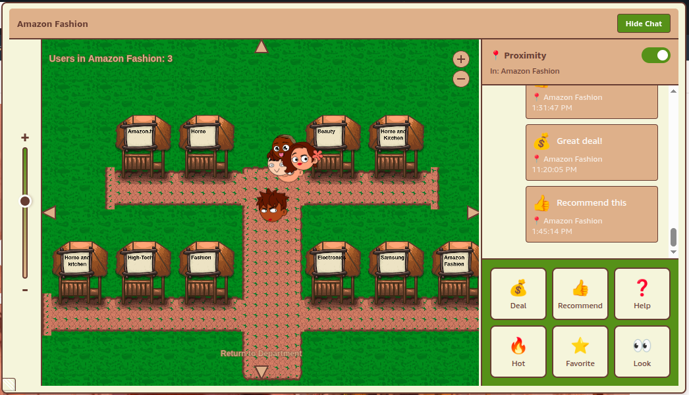
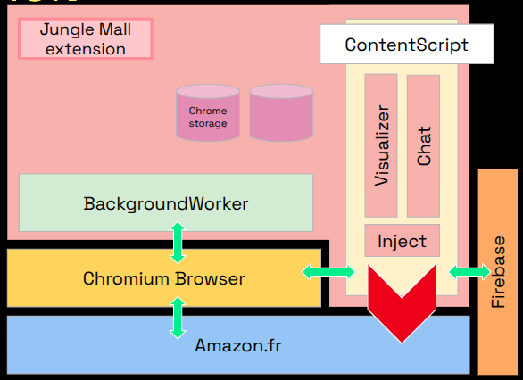

# Jungle Mall

A Chrome extension that transforms Amazon.fr into a social shopping experience, allowing you to browse and shop alongside your friends in real-time.

[Our presentation slides](https://docs.google.com/presentation/d/1DUt4Tv4iVS7Xjk5UND307TIl9-mh5bG03Uv2dws9xWc/edit?usp=sharing)
[Our Report](https://docs.google.com/document/d/1LBssJNEav7f4nCLgg_qLQacSnYyv8-5mmo4unnjftGA/edit?usp=sharing)

  

## Motivation

Online shopping has become an integral part of modern life, but it often feels isolating and time-consuming. When you shop on platforms like Amazon, you're essentially alone, scrolling through endless product listings, reading reviews from strangers, and making decisions without any social context.

Shopping online requires hours of comparison and research for a simple purchase, reducing time with friends. Compare this to the experience of visiting a physical shopping mall with friends, where you can browse together, ask for opinions, and discover things through shared exploration. That social dimension is completely missing from online commerce.

**What if we could turn the online marketplace into a place you could visit with your friends?**

Jungle Mall addresses this by transforming Amazon.fr into a virtual shopping mall where users can see each other in real-time, interact, and make the shopping experience genuinely social rather than solitary. The system scrapes information from the web page to intelligently place users in different "departments" based on what they're viewing, creating a spatial representation of the shopping experience.



_The virtual mall shows users as avatars in different departments based on their browsing activity_

## Features

-   **Real-time presence**: See friends' avatars positioned in departments as they browse
-   **Place discovery**: Click avatars to view what others are looking at
-   **Quick messaging**: Communicate using predefined messages (Deal, Recommend, Help, etc.)
-   **Navigation controls**: Zoom, pan, and move around the virtual mall
-   **Interactive visualization**: Hover for previews, click to navigate together

## Installation

1. Clone the repository:

    ```bash
    git clone https://github.com/pandanautinspace/amazon-marketplace-visualizer.git
    cd amazon-marketplace-visualizer
    ```

2. Install dependencies and build:

    ```bash
    npm install
    npm start
    ```

3. Load the extension in Chrome:

    - Navigate to `chrome://extensions/`
    - Enable "Developer mode"
    - Click "Load unpacked" and select the `build` folder

4. Visit Amazon.fr to start using Jungle Mall

## Tech Stack

-   **Frontend**: React 18, PixiJS, Tailwind CSS
-   **Backend**: Firebase/Firestore
-   **Build**: Webpack 5, Babel
-   **Extension**: Chrome Manifest V3

## Development

```bash
# Start development server with hot reload
npm start

# Build for production
npm run build
```

## Usage

Once installed, navigate to Amazon.fr. The Jungle Mall interface will automatically appear, showing:

-   Your avatar and friends' avatars in different departments
-   Chat panel for sending messages
-   Navigation controls for exploring the virtual mall

Click on avatars to see what others are viewing, or send quick messages to communicate.

## Architecture

The extension consists of:

-   **BackgroundWorker**: Manages user IDs and persistence
-   **ContentScript**: Injects the visualization into Amazon.fr pages
-   **Visualizer Component**: Renders the interactive canvas using PixiJS
-   **Chat Component**: Handles real-time messaging via Firebase



_System architecture showing extension components and data flow_

## Next Steps

-   Avatar customization
-   Real-time position tracking with smooth movement
-   Private messaging between users
-   Standalone tab view

## Contributors

-   Kenneth Browder
-   Keryan Cossard
-   Soheil Lotfi

<i>Developed as a part of "Advanced Programming of User Interfaces" Course at Institut Polytechnique de Paris</i>

## License

Educational and non-commercial use.
